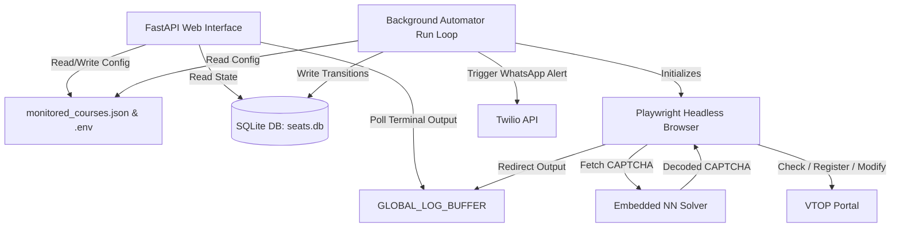

# ⚡ VIT VTOP Course Add/Drop Automation & Monitoring System

[](https://fastapi.tiangolo.com/)
[](https://playwright.dev/)
[](https://sqlite.org/)
[](https://www.docker.com/)
[](https://www.python.org/)

An advanced, high-frequency, headless browser automation tool and real-time monitoring dashboard designed for the **VIT VTOP Course Add/Drop Portal**. Built using **FastAPI**, **Playwright**, **SQLite**, and **Pillow**, the system automates seat status checking, registration, course modification, and notification delivery with zero human intervention.

---

## 📖 Project Overview & The "Why"
During university registration cycles, seat availability changes rapidly. Manual checking is exhausting, error-prone, and slow. This project solves these challenges by combining:
1. **Automated Captcha Solving** using a lightweight, embedded neural network that decodes captchas client-side in milliseconds.
2. **Headless Browser Orchestration** via Playwright to simulate high-speed human interactions.
3. **Multi-Course Sequence Monitoring** with intelligent heuristics for slot and faculty matchmaking.
4. **A Real-Time Web Command Center** built on FastAPI to adjust configurations dynamically, view live logs, and track history.
5. **Immediate Notifications** using Twilio WhatsApp Integration to alert users the second a seat opens.

---

## 🏗️ System Architecture



---

## 🌟 Core Features & Deep Technical Details

### 1. 🧠 Lightweight Embedded CAPTCHA Solver
Rather than relying on heavy OCR engines (like Tesseract) or cloud services, this system features a lightweight, single-layer neural network ported from JavaScript (`ViBoot` extension) to pure Python:
* **Preprocessing (Saturation-based Segmentation)**: The input 200x40 pixel RGBA CAPTCHA image is converted to per-pixel saturation values and split into 6 character blocks using geometric heuristics.
* **Neural Network Forward Pass**: Uses static weight matrices (`NN_WEIGHTS`) and bias vectors (`NN_BIASES`) stored as pre-calculated bitmaps. A simple Matrix Multiplication (`@`) and `softmax` layer classify each character.
* **Efficiency**: Executes in `<15ms` with `>90%` accuracy, requiring zero external machine learning frameworks (like PyTorch or TensorFlow).

### 2. 🤖 Playwright Browser Automation & Session Recovery
* **Dual Workflows (Registration & Modification)**:
  * **Registration Flow**: Logs in, passes the instructions screen, bypasses progress checks, navigates categories, and auto-submits.
  * **Modification Flow**: Clicks *View/Modify*, targets a specific course, handles the VTOP OTP screen, polls Gmail via IMAP for the 6-character code matching the required prefix, enters it, and completes the swap.
* **Self-Healing Loop**: The automation loop catches timeouts, session expirations, or portal logouts. It terminates the broken context, spawns a new Chromium instance, solves CAPTCHAs, and resumes tracking within seconds.
* **Fast-Refresh Single-Course Loop**: Optimization that skips VTOP dashboard reloading when monitoring a single course. It executes a local "Go Back ➡️ Proceed" loop to check seats up to 5x faster.

### 3. 🖥️ FastAPI Real-Time Dashboard
* **Dynamic Environment Manager**: Interactive settings modal allows updating VTOP credentials, Gmail accounts, Twilio API tokens, delay intervals, and monitoring modes. Writes updates directly to the local `.env` and applies changes immediately.
* **Course Pipeline Configuration**: Drag-and-drop style JSON parser allowing custom actions (`monitor` / `register` / `modify`), preferred faculty names, and target slot codes.
* **Live console logging**: Overrides `sys.stdout` and `sys.stderr` using a custom `LiveLogWriter` stream class. Streams real-time server output and scraper metrics directly to the browser console.
* **Seat Availability Slider**: Visual component letting users toggle through monitored subjects dynamically.

### 4. 🔒 Privacy & "Blur Mode" Anonymization
Specifically designed for public screen sharing or recording, the dashboard implements a strict privacy configuration:
* **Client-Side CSS Filters**: Hides sensitive dashboard cards, personal names, registration numbers, and phone numbers.
* **Backend Log Redaction**: Scans console output buffers using regex pattern matchers to redact raw phone numbers and target faculty names from live terminal log streams before delivering them via API.

### 5. 📊 Relational Database State-Transition Logging
* **SQLite Persistence**: Stores seat metrics, timestamped runs, and state change flags in `seats.db`.
* **Table-Bloat Prevention**: Filters incoming scrapes against the most recent entry. A new record is created only if availability numbers change, or if a numerical seat count transitions to/from a "Full" state.

---

## 📁 Directory Structure

```text
vtop-add-drop-automation/
│
├── main.py                    # Main FastAPI App, API routes, Scraper Loop & HTML Template
├── Dockerfile                 # Multi-stage Playwright Docker setup
├── render.yaml                # Render Infrastructure-as-Code deployment configuration
├── requirements.txt           # Python packages
├── monitored_courses.json     # Persisted JSON configurations for course pipeline
├── seats.db                   # SQLite database (auto-generated)
│
├── src/
│   ├── __init__.py
│   ├── bitmaps.py             # Pre-calculated neural network weights & biases
│   ├── captcha_solver.py      # Saturation segmenter & neural net classifier
│   ├── fetch_otp.py           # Gmail IMAP client & regex OTP parser
│   └── modify_course.py       # Standalone Playwright script for Course Modification
│
└── tools/
    ├── convert_bitmaps.py     # Utility to convert JS-array weights to Python structures
    ├── show_db.py             # Standalone tool to print the last 60 database entries
    └── test_captcha.py        # CAPTCHA downloader & solver accuracy testing tool
```

---

## ⚙️ Configuration & Environment Variables

Create a `.env` file in the root directory based on `.env.example`:

| Variable | Description | Example / Default |
| :--- | :--- | :--- |
| `DISPLAY_NAME` | Name shown on the dashboard greeting. | `Sri Krishna R` |
| `VTOP_USERNAME` | Your VIT VTOP registration username. | `20BCE0000` |
| `VTOP_PASSWORD` | Your VIT VTOP registration password. | `••••••••` |
| `GMAIL_ADDRESS` | Gmail address used to receive OTPs. | `your.email@gmail.com` |
| `GMAIL_APP_PASSWORD` | App-specific password generated in Google Account. | `abcd efgh ijkl mnop` |
| `MONITOR_DELAY_SECONDS`| Delay interval between scraping iterations. | `30` (seconds) |
| `REGISTER` | Globally enable/disable course registration action. | `false` |
| `MODIFY` | Globally enable/disable course modification action. | `false` |
| `WHATSAPP_ENABLED` | Toggle Twilio WhatsApp notification alerts. | `false` |
| `TWILIO_ACCOUNT_SID` | Twilio Account SID for sending notifications. | `AC••••••••••••••••` |
| `TWILIO_AUTH_TOKEN` | Twilio API Auth Token. | `••••••••••••••••` |
| `TWILIO_FROM_NUMBER` | Sandbox Twilio WhatsApp sender number. | `whatsapp:+14155238886` |
| `MY_PHONE_NUMBER` | Your personal WhatsApp receiver number. | `whatsapp:+919080014281` |
| `BLUR` | Enable Privacy/Anonymization mode. | `false` |
| `print_scrapper_data_in_terminal` | Print full stdout debug lines for scraped seats. | `true` |

---

## 🚀 Setup & Execution Guide

### 1. Installation

```bash
# Clone the repository
git clone https://github.com/yourusername/vtop-add-drop-automation.git
cd vtop-add-drop-automation

# Create and activate virtual environment
python3 -m venv venv
source venv/bin/activate

# Install dependencies
pip install -r requirements.txt

# Download Playwright Chromium browser binary
playwright install chromium
```

### 2. Running the Server

```bash
# Start the FastAPI Dashboard & background Scraper
python3 main.py
```
*Access the local control dashboard at `http://localhost:8080/`.*

### 3. Running with Docker

```bash
# Build the Docker image
docker build -t vtop-automation-bot .

# Run the container
docker run -p 8080:8080 --env-file .env vtop-automation-bot
```

---

## 🔧 Helper Tools & Verification Scripts

### CAPTCHA Solver Accuracy Test
Download real VTOP CAPTCHAs and verify the solver predictions without logging in:
```bash
python3 tools/test_captcha.py --count 10
```
This downloads 10 samples to `captcha_samples/` and prints the solver predictions. You can compare the saved images with the predictions.

### Database Query Tool
View the last 60 stored seat logs, state transitions, and change flags:
```bash
python3 tools/show_db.py
```

---

## 🤝 Acknowledgements & Credits
* **Neural Network Weights**: Decrypting method coefficients and node indices are ported from the **ViBoot** Chrome extension.
